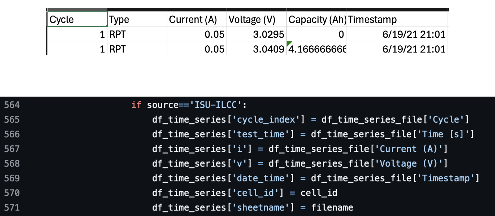

## Getting the dataset ready for import
1.	Create a folder with a file named “cell_list” and a folder with data for each cell you want to upload. 
Example given for UCONN dataset: UCONN folder has file named cell_list and a folder “G14C5” with all of the data for that particular cell. Sometimes all of the cell data may be in a single Excel/csv file. Sometimes the data may be in multiple files. The existing importers account for both situations.
    1. If you are importing module or stack data, the cell_list will instead be called "module_list" or "stack_list." Each stack or module data should be in its own folder as well.
3.	The “cell_list” file contains all of the metadata that the data importer is looking for.
4.	Review the cell raw data files and, based on the file structure, identify which importer should be used in the overall import script. There are importers for several different kinds of battery testers and generic csv files. The appropriate selection should be noted in the ‘tester’ column of the cell_list file. See the 'Updating the importer script' section for more details.


## Updating the importer script
Currently, the data_import_agent.py script supports files of matlab, json, arbin, voltaiq-csv, and generic-csv. However, the exact structure of the files you have versus what the importer already uses may be different or you might have a completely new file type.

1. Open the x_data_import_agent.py (where x is your battery type) script in your preferred code editor. If your file is one of the types listed above, head to the appropriate 'read_save_timeseries_filetype()' function.
    1. If not, you will need to write a new function. Duplicate one of the existing functions and make edits to fit your new file type. You will also need to create a new type selection in the add_ts_md_cycle() function.
3. Open a data file you wish to import. Compare the column names of your file with the column naming section of the function (see image). 


4. If the column names differ, edit the appropriate df_time_series_file['column name'] to match your data file.

## Running the import script (General)
1. Migrate to the batteryarchive-agent/scripts directory on your computer. Type the following command with the directory of your data. The choices for 'batt_type' are 'li-cell', 'li-module', 'flow-cell', and 'flow-stack'.
    1. `python3 data_import_agent.py -s 'batt_type' -p 'data_directory'`
3. If the code completes successfully, check the database on pg admin to see if the data populated. Compare this data with your original data files.
4. Migrate back to the batteryarchive-agent directory and refresh queries by running ./bin/refresh_queries
5. Open redash and your data should be populated.

### Import example:
``` bash
cd batteryarchive-agent/scripts

python3 data_import_agent.py -s 'li-cell' -p /Users/lnkassa/Desktop/UCONNdata/

cd ..

./bin/refresh_queries
```

## Importing sample data
``` bash
cd batteryarchive-agent/scripts

#importing li-ion cell sample
python3 data_import_agent.py -s 'li-cell' -p ../data/li-ion_cell_samples/

cd ..

./bin/refresh_queries

#importing li-ion module sample
cd scripts

python3 data_import_agent.py -s 'li-module' -p ../data/li-ion_module_samples/

cd ..

./bin/refresh_queries

#importing flow cell sample
cd .. 

python3 data_import_agent.py -s 'flow-cell' -p ../data/flow_cell_samples/

cd ..

./bin/refresh_queries

#importing flow stack sample
cd scripts

python3 data_import_agent.py -s 'flow-stack' -p ../data/flow_stack_samples/

cd ..

./bin/refresh_queries
```